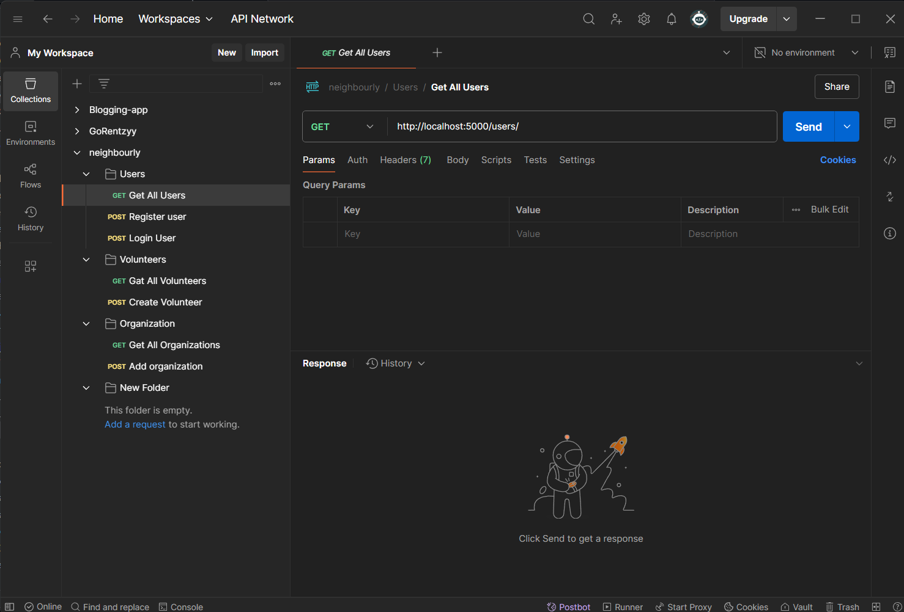
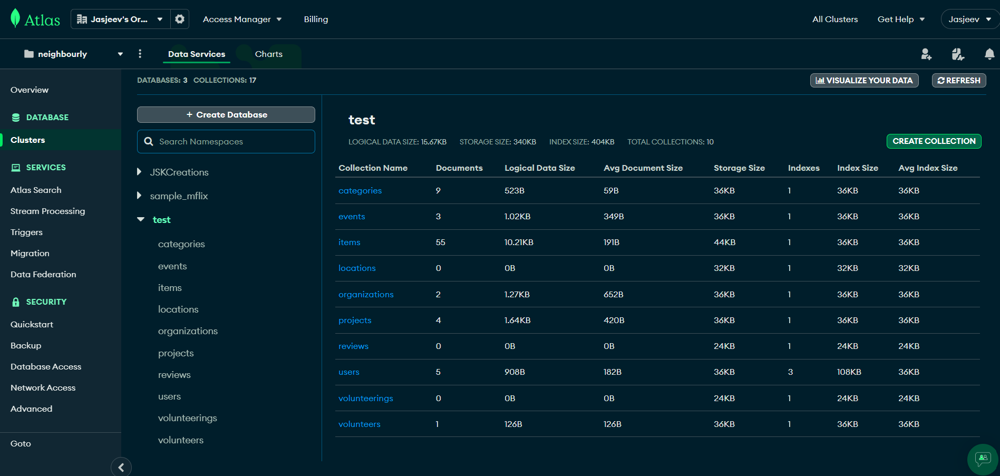
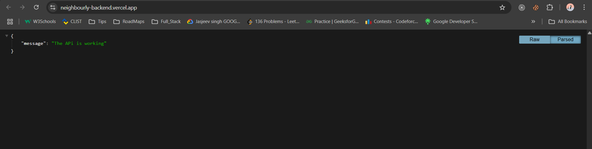

# Neighbourly: Let's Connect Communities - Backend

 

## 🌟 About The Project

Neighbourly is a community engagement platform that enables people to create, publish, and participate in a wide range of events - from social services and technical hackathons to contests, quizzes, and national events. This repository contains the backend API powering the Neighbourly platform.

**Key Features:**
- User authentication and authorization (JWT)
- Event management system
- Volunteer registration and tracking
- Organization profiles
- Project and event categorization
- Review and rating system
- Image uploads via Cloudinary

---

## 📋 Table of Contents
1. [Tech Stack](#-tech-stack)
2. [API Documentation](#-api-documentation)
3. [Installation](#-installation)
4. [Configuration](#-configuration)
5. [Directory Structure](#-directory-structure)
6. [Database Schema](#-database-schema)
7. [Screenshots](#-screenshots)
8. [Contributing](#-contributing)
9. [Contact](#-contact)

---

## 🛠 Tech Stack

### Backend
- **Node.js** - Runtime environment
- **Express** - Web framework
- **MongoDB** - Database
- **Mongoose** - ODM for MongoDB
- **JWT** - Authentication
- **Cloudinary** - Image storage
- **Multer** - File upload handling

### Development Tools
- **Nodemon** - Development server
- **Postman** - API testing
- **Vercel** - Deployment

---

## 📚 API Documentation

### Base URL
`https://neighbourly-backend.vercel.app/`

### Authentication
| Endpoint          | Method | Description                | Auth Required |
|-------------------|--------|----------------------------|---------------|
| `/register`  | POST   | Register new user          | No            |
| `/login`     | POST   | Login user                 | No            |

### Events
| Endpoint                 | Method | Description                          | Auth Required       |
|--------------------------|--------|--------------------------------------|---------------------|
| `/events`                | GET    | Get all events                       | No                  |
| `/events`                | POST   | Create new event                     | Organization        |
| `/events/:id`            | GET    | Get event by ID                      | No                  |
| `/events/:id`            | PUT    | Update event                         | Organization        |
| `/events/:id`            | DELETE | Delete event                         | Organization        |
| `/events/projects/:id`   | GET    | Get events by project ID             | No                  |

*(Complete API documentation available in [All Routes.docx](./All%20Routes.docx)*

---

## 💻 Installation

### Prerequisites
- Node.js (v14+)
- MongoDB Atlas account or local MongoDB installation
- Cloudinary account (for image storage)

### Setup Instructions
1. Clone the repository:
   ```bash
   git clone https://github.com/jasjeev013/neighbourly-backend.git
   cd jasjeev013-neighbourly-backend
   ```

2. Install dependencies:
   ```bash
   npm install
   ```

3. Create a `.env` file in the root directory with the following variables:
   ```
   MONGODB_URI=your_mongodb_connection_string
   JWT_SECRET=your_jwt_secret_key
   CLOUDINARY_CLOUD_NAME=your_cloudinary_name
   CLOUDINARY_API_KEY=your_cloudinary_key
   CLOUDINARY_API_SECRET=your_cloudinary_secret
   PORT=5000
   ```

4. Start the development server:
   ```bash
   npm start
   ```

The API will be available at `http://localhost:5000`

---

## ⚙ Configuration

### Environment Variables
| Variable Name               | Description                          | Required |
|-----------------------------|--------------------------------------|----------|
| `MONGODB_URI`               | MongoDB connection string           | Yes      |
| `JWT_SECRET`                | Secret key for JWT tokens           | Yes      |
| `CLOUDINARY_CLOUD_NAME`     | Cloudinary cloud name               | Yes      |
| `CLOUDINARY_API_KEY`        | Cloudinary API key                  | Yes      |
| `CLOUDINARY_API_SECRET`     | Cloudinary API secret               | Yes      |
| `PORT`                      | Server port (default: 5000)         | No       |

---

## 📂 Directory Structure

```
jasjeev013-neighbourly-backend/
├── config/
│   ├── cloudinary.js      # Cloudinary configuration
│   └── multer.js          # File upload middleware
├── images/                # Uploaded images (development)
├── middleware/
│   └── auth.js            # Authentication middleware
├── models/
│   ├── category.js        # Event categories
│   ├── event.js           # Events model
│   ├── location.js        # Locations model
│   ├── organization.js    # Organizations model
│   ├── project.js         # Projects model
│   ├── review.js          # Reviews model
│   ├── user.js            # Users model
│   ├── volunteer.js       # Volunteers model
│   └── volunteering.js    # Volunteering model
├── routes/
│   ├── auth.js            # Authentication routes
│   ├── categories.js      # Category routes
│   ├── events.js          # Event routes
│   ├── locations.js       # Location routes
│   ├── organizations.js   # Organization routes
│   ├── profile.js         # Profile routes
│   ├── projects.js        # Project routes
│   ├── reviews.js         # Review routes
│   ├── users.js           # User routes
│   ├── volunteering.js    # Volunteering routes
│   └── volunteers.js      # Volunteer routes
├── index.js               # Main application file
├── package.json           # Project dependencies
└── vercel.json            # Vercel deployment config
```

---

## 🗃 Database Schema

<!--  *(Replace with database schema image)* -->

Key Models:
- **Users**: Base user accounts (volunteers/organizations)
- **Volunteers**: Extended volunteer profiles
- **Organizations**: Extended organization profiles
- **Projects**: Community projects
- **Events**: Specific project events
- **Volunteering**: Volunteer-event relationships
- **Reviews**: Volunteer feedback

---

## 📸 Screenshots

### API Endpoints
 

### Database Models
 

### API Working
 

---

## 🤝 Contributing

We welcome contributions! Please follow these steps:

1. Fork the project
2. Create your feature branch (`git checkout -b feature/AmazingFeature`)
3. Commit your changes (`git commit -m 'Add some AmazingFeature'`)
4. Push to the branch (`git push origin feature/AmazingFeature`)
5. Open a Pull Request

---


## 📧 Contact

**Jasjeev**  
- GitHub: [@jasjeev013](https://github.com/jasjeev013)
- Email: jasjeev99@gmail.com


---
